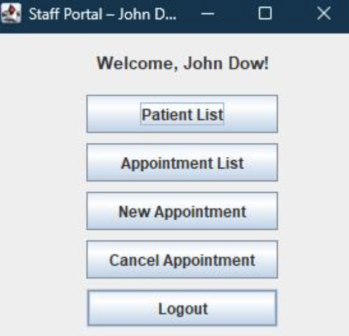
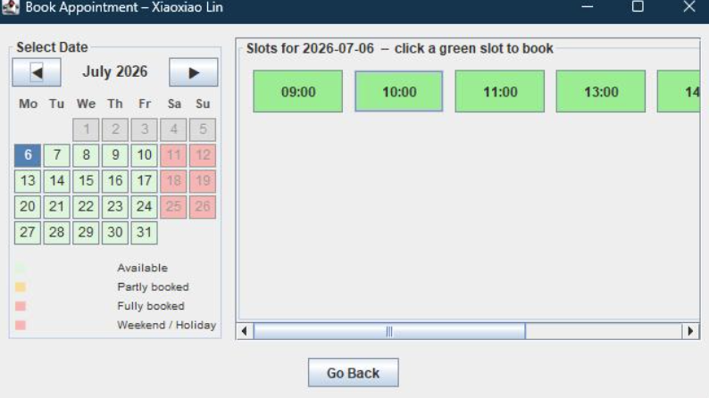

# Dental Reservation System

A Java desktop application for managing dental appointments, built with Swing, SQLite, and Maven. Supports two user roles — **patients** and **staff** — with separate dashboards and a colour-coded interactive calendar for booking.

---

## Screenshots

<table width="100%">
    <tr>
        <td align="center" width="33%"><br /><sub>Main menu</sub></td>
        <td align="center" width="33%"><br /><sub>Login screen</sub></td>
        <td align="center" width="33%"><br /><sub>Calendar view</sub></td>
    </tr>
</table>

## Highlights

### Layered Architecture (Model / DAO / GUI)

Business logic, data access, and UI are kept strictly separate. Each table has its own DAO class (`PatientDAO`, `EmployeeDAO`, `AppointmentDAO`) that handles all SQL for that entity. GUI classes never touch the database directly.

### Security

- **BCrypt password hashing** (jBCrypt 0.4, cost factor 10) — passwords are hashed before storage; seed account hashes are pre-computed so no plain-text password ever appears in source code or the database.
- **SQL injection prevention** — every query uses `PreparedStatement` with parameterised placeholders.
- **Foreign key enforcement** — enabled explicitly via `PRAGMA foreign_keys = ON` (SQLite disables this by default).

### Double-Booking Prevention at Two Levels

1. **Database** — `date_time` column carries a `UNIQUE` constraint; a duplicate insert will fail at the DB level regardless of the application state.
2. **Application** — `AppointmentDAO.isSlotTaken()` checks availability before attempting the insert and returns a user-friendly error rather than exposing a raw SQL exception.

### Interactive Calendar UI

- Custom Swing calendar grid built without third-party UI libraries.
- Days are colour-coded by availability: green (free) → orange (partly booked) → red (fully booked).
- Weekends and Czech public holidays are automatically disabled.
- Past dates are greyed out and non-clickable.

### Docker Support

- **Multi-stage Dockerfile**: Maven + JDK image compiles and packages the fat JAR; a lean JRE-only image runs it — final image is ~450 MB instead of ~800 MB.
- X11 libraries included so the Swing GUI can be forwarded to the host display.
- `.dockerignore` excludes `.git`, `target`, and `dental.db` to keep the build context minimal.

---

## Tech Stack

| Layer     | Technology                                    |
| --------- | --------------------------------------------- |
| Language  | Java 17                                       |
| GUI       | Java Swing                                    |
| Database  | SQLite (`dental.db` via `sqlite-jdbc 3.45.3`) |
| Security  | jBCrypt 0.4                                   |
| Build     | Maven + `maven-shade-plugin` (fat JAR)        |
| Container | Docker (multi-stage build)                    |

---

## Project Structure

```
src/main/java/
├── Main.java                    ← Entry point: DB init → Swing EDT
├── model/
│   ├── Patient.java
│   ├── Employee.java
│   └── Appointment.java
├── database/
│   ├── DatabaseManager.java     ← Connection, schema creation, seeding
│   ├── PatientDAO.java          ← CRUD for patients
│   ├── EmployeeDAO.java         ← CRUD for employees
│   └── AppointmentDAO.java      ← CRUD for appointments, slot-availability check
└── gui/
    ├── WelcomePage.java         ← Login + patient registration
    ├── PatientMenu.java         ← Patient dashboard
    ├── EmployeeMenu.java        ← Staff dashboard
    └── CalendarView.java        ← Interactive booking calendar
```

---

## Database Schema

```sql
CREATE TABLE patients (
    id        INTEGER PRIMARY KEY AUTOINCREMENT,
    name      TEXT NOT NULL,
    username  TEXT NOT NULL UNIQUE,
    password  TEXT NOT NULL,           -- BCrypt hash
    email     TEXT DEFAULT '',
    address   TEXT DEFAULT '',
    telephone TEXT DEFAULT ''
);

CREATE TABLE employees (
    id        INTEGER PRIMARY KEY AUTOINCREMENT,
    name      TEXT NOT NULL,
    username  TEXT NOT NULL UNIQUE,
    password  TEXT NOT NULL,           -- BCrypt hash
    role      TEXT NOT NULL CHECK(role IN ('dentist','staff'))
);

CREATE TABLE appointments (
    id         INTEGER PRIMARY KEY AUTOINCREMENT,
    patient_id INTEGER NOT NULL,
    date_time  TEXT NOT NULL UNIQUE,   -- ISO-8601 e.g. "2025-07-25T11:00"
    FOREIGN KEY (patient_id) REFERENCES patients(id) ON DELETE CASCADE
);
```

---

## Getting Started

### Run with IntelliJ IDEA

1. `File` → `Open` → select the project folder (IntelliJ detects `pom.xml` automatically).
2. Let Maven download dependencies (`sqlite-jdbc`, `jbcrypt`) — requires internet on first run.
3. Open `src/main/java/Main.java` and click ▶.

`dental.db` is created in the project root on first launch.

### Run with Docker

```bash
# Build
docker build -t dental-reservation .

# Run (Windows — requires VcXsrv running with "Disable access control" checked)
docker run -e DISPLAY=host.docker.internal:0.0 dental-reservation

# Run (Linux/macOS)
docker run -e DISPLAY=$DISPLAY -v /tmp/.X11-unix:/tmp/.X11-unix dental-reservation
```

---

## Default Login Credentials

| Role    | Username | Password |
| ------- | -------- | -------- |
| Dentist | `djohn`  | `12345`  |
| Dentist | `Sami`   | `54321`  |

Patient accounts are created via **"Create Account"** on the login screen.

---

## Key Design Decisions vs. Original Version

| Aspect               | Original              | This version                                           |
| -------------------- | --------------------- | ------------------------------------------------------ |
| Storage              | `ArrayList` in RAM    | SQLite — data persists across restarts                 |
| Double-booking       | Not prevented         | `UNIQUE` constraint + application-level check          |
| Architecture         | Logic mixed into GUI  | Model / DAO / GUI separation                           |
| Password storage     | Plain text            | BCrypt hashed (cost 10)                                |
| Build & dependencies | Manual JAR management | Maven — single `mvn package` produces runnable fat JAR |
| Deployment           | Run from IDE only     | Dockerised — runs anywhere Docker is installed         |
